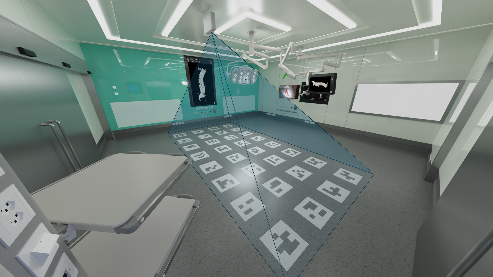

<div align="center">
<h1>CalibProj: Automatic Calibration of a Multi-Camera System <br>
with Limited Overlapping Fields of View  <br>
for 3D Surgical Scene Reconstruction

</h1>


[**Tim Flückiger**](https://www.linkedin.com/in/timflueckiger/)<sup>&#9733;</sup> · [**Jonas Hein**](https://scholar.google.com/citations?user=Kk_o9AYAAAAJ&hl=fr&oi=ao)<sup></sup> · [**Valery Fischer**](https://www.linkedin.com/in/valery-fischer/)<sup></sup>
<br>
[**Philipp Fürnstahl**](https://scholar.google.com/citations?user=nQ4B3BgAAAAJ&hl=fr)<sup></sup> · [**Lilian Calvet**](https://scholar.google.com/citations?user=6JewdrMAAAAJ&hl=fr)<sup></sup>

<span>&#9733;</span> corresponding author

<a href='https://arxiv.org/abs/2501.16221'></a>

<a href='https://tflueckiger.github.io/calib-proj/'></a>
</div>


<!--  -->

<p align="center">
  
  <video id="dollyzoom" autoplay muted loop playsinline style="width:49%;">
    <source src="docs/static/videos/video_iphone.mp4" type="video/mp4" />
  </video>
</p>

##  Automatic Multi-Camera External Calibration Using Projected Markers

We present  <span style="font-variant:small-caps;">CalibProj</span>, a Python toolkit for <b>automatically calibrating the positions and orientations of multiple cameras</b>, even when they have very limited field of view overlap or they have very different zoom levels. Unlike traditional methods, this approach requires <b>no manual intervention, calibration board, or prior calibration expertise.</b>

<span style="font-variant:small-caps;">CalibProj</span> uses a ceiling-mounted projector to display specially designed multi-scale markers (MSMs)—2D patterns at varying sizes—onto the scene. These projected markers can be seen from multiple angles and distances, enabling cameras with different viewpoints and zoom settings to detect and extract accurate feature correspondences. Importantly, <b>the projector itself does not need to be calibrated.</b>
Such a system is especially useful for:

<ul>
<li>Camera networks with different fields of view (e.g., in an operating room)</li>
<li>Multi-zoom or pan-tilt-zoom (PTZ) camera installations</li>
<li>Surveillance systems with cameras mounted far apart</li>
</ul>


## **Table of Contents** 📋
- [Installation](#installation) 
- [Documentation](#documentation) 
- [How To Use](#how-to-use) 
- [Citation](#citation)
- [License](#license) 
- [Acknowledgments](#acknowledgments)

## **Installation** 


### Dependencies (calib-commons) ⛓️
The package depends on the custom utilities Python package 🧰 [`calib-commons`](https://github.com/tflueckiger/calib-commons). To install it:

   ```bash
   # clone the repos
   git clone https://github.com/tflueckiger/calib-commons.git
   cd calib-commons
   # install the package with pip
   pip install .
   # optional: install in editable mode:
   pip install -e . --config-settings editable_mode=strict
   ```

> ⛓️ Dependencies : if the additional dependencies listed in requirements.txt are not satisfied, they will be automatically installed from PyPi. 


### Installation of CalibProj

 ```bash
   # clone the repos
   git clone https://github.com/tflueckiger/calib-proj.git
   cd calib-proj
   # install the package with pip
   pip install .
   # optional: install in editable mode:
   pip install -e . --config-settings editable_mode=strict
   ```
---


## **Documentation** 

### 📝 **Prequisites**
Ensure you have the following before running the package:

 **Internal Camera Parameters (Intrinsics)** ⚙️📷
>💡 This can be done using using the [`calib-commons`](https://github.com/tflueckiger/calib-commons) toolbox, which includes a ['calibrate-intrinsics'](https://github.com/tflueckiger/calib-commons?tab=readme-ov-file#calibrate-intrinsics) command-line tool for automatic internal calibration of multiple cameras using either videos recordings or images. The tool creates a folder containing camera intrinsics in JSON files matching the required format. See here for documentation on how to generate intrinsics with ['calibrate-intrinsics'](https://github.com/tflueckiger/calib-commons?tab=readme-ov-file#calibrate-intrinsics).


## **How To Use**

### 1. Projection Sequence Generation

To generate a projection sequence in **.mp4** format, run the script `scripts/run_video_generator.py`: 
```bash
   python scripts/run_video_generator.py
```
By default this will create a video of 40s containing 3200 multi-scale markers (MSMs) with 4 scales.


The video will be saved in `video/video.mp4` and a file containing metadata about the sequence is saved in `video/seq_info.json`.


### 2. Acquisition 

Mount the projector on the ceiling and start the projection sequence.

### 3. Calibration 
To run the calibration system, modify the parameters in the user interface of the script `scripts/run.py`. 

In particular, 

- **videos_folder** must be the path to the folder containing the cameras recordings as follows:

```plaintext
videos_folder/
├── camera1.mp4
├── camera2.mp4
└── ...
```
- **intrinsics_folder** must be the path to the folder containing the cameras intrinsics as follows:


```plaintext
intrinsics_folder/
├── camera1_intrinsics.json
├── camera2_intrinsics.json
└── ...
```

>💡 This can be done using using the ['calibrate-intrinsics'](https://github.com/tflueckiger/calib-commons?tab=readme-ov-file#calibrate-intrinsics) tool of the [`calib-commons`](https://github.com/tflueckiger/calib-commons) toolbox.


To start the calibration:

```bash
   python scripts/run.py
```

The will run the 4 steps: 
- temporal synchronization 
- frames extraction 
- MSMs detection 
- calibration 


### 4. Output 
The camera poses 📐are saved in ***results/camera_poses.json***.

In addition, the following **metrics** 🎯, per camera and overall, are saved in ***results/metrics.json***: 
- mean **reprojection error**
- standard deviation of the reprojection error
- view score of the cameras for the calibration dataset (score introduced and used by [COLMAP](https://openaccess.thecvf.com/content_cvpr_2016/papers/Schonberger_Structure-From-Motion_Revisited_CVPR_2016_paper.pdf))
- number of correspondences for each cameras 

> The *number of correspondences* of a camera corresponds to the number of conform observations a camera has of object (=3D) points with a track length higher or equal to 2. 

> The *track* of an object (=3D) point is the set of cameras in which the point is observed, and for which the observation is conform.


<figure style="text-align: center;">
    
</figure>

<figure style="text-align: center;">
    
</figure>

---


## **Citation**


BibTeX:
```bibtex
@misc{fluckiger2025automatic,
  title={Automatic Calibration of a Multi-Camera System with Limited Overlapping Fields of View for 3D Surgical Scene Reconstruction},
  author={Tim Flückiger and Jonas Hein and Valery Fischer and Philipp Fürnstahl and Lilian Calvet},
  year={2025},
  eprint={2501.16221},
  archivePrefix={arXiv},
  primaryClass={cs.CV},
  note={Preprint, arXiv:2501.16221},
  url={https://arxiv.org/abs/2501.16221}
}
```
APA-style:
```
Flückiger, T., Hein, J., Fischer, V., Fürnstahl, P., & Calvet, L. (2025). Automatic Calibration of a Multi-Camera System with Limited Overlapping Fields of View for 3D Surgical Scene Reconstruction. arXiv preprint arXiv:2501.16221. https://arxiv.org/abs/2501.16221
```
---

## **License**

This project is licensed under the **MIT License**. See the [LICENSE](https://github.com/tflueckiger/calib-proj/blob/main/LICENSE) file for details.

---

## **Acknowledgments**
This work has been supported by the [OR-X](https://or-x.ch/en/translational-center-for-surgery/) - a swiss national research infrastructure for translational surgery - and associated funding by the University of Zurich and University Hospital Balgrist. 
